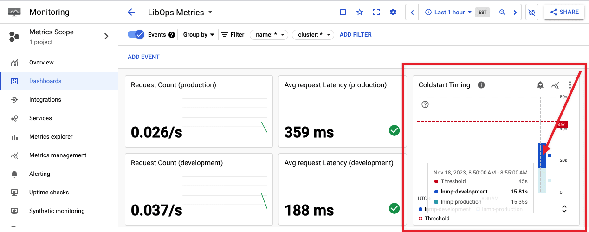
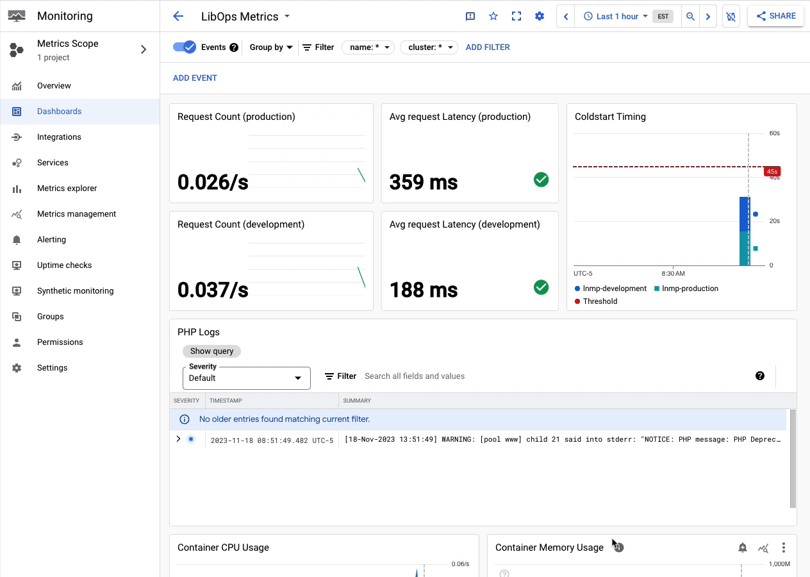
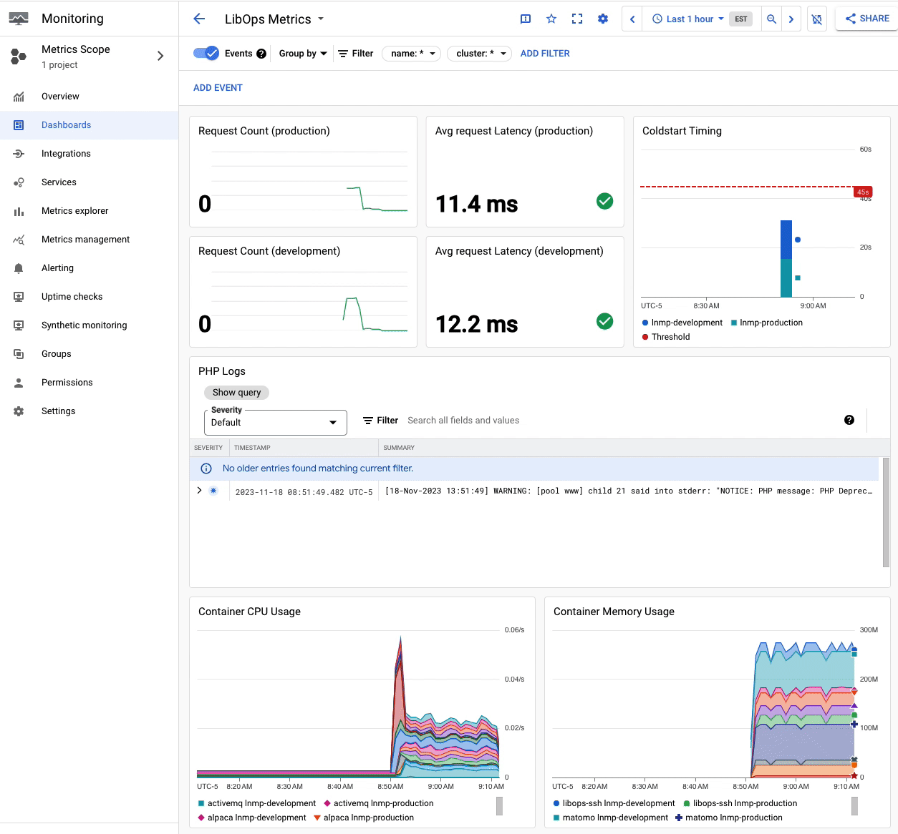

# LibOps Metrics

Your LibOps site services emits metrics that are aggregated and displayed on your LibOps Metrics dashboard. You can find the link to you dashboard at [https://www.libops.io/user](https://www.libops.io/user)

## Timing metrics

At the top of the metrics dashboard are metrics related to the number of requests and latency of those requests to your site, grouped by environment.

There's also a metric to record how long your environment takes to come online after a cold start. Keep in mind, cold starts only happen during a period of inactivity to your development environment (and also your production environment for sites not on a payment plan)

## PHP Logs

The dashboard contains a filtered log view of any PHP errors that might be occurring on your site. There's also a link to the log explorer for further log analysis/troubleshooting.

## Container metrics

All of the services running on your LibOps envionrment have CPU, memory, i/o, and network metrics emitted. These metrics can be viewed as an aggregate of all environments and all containers

### Filter container metrics

You also can filter which container metrics to view by selecting `cluster` to filter by a given LibOps environment and/or selectioning `name` to filter by a given service

